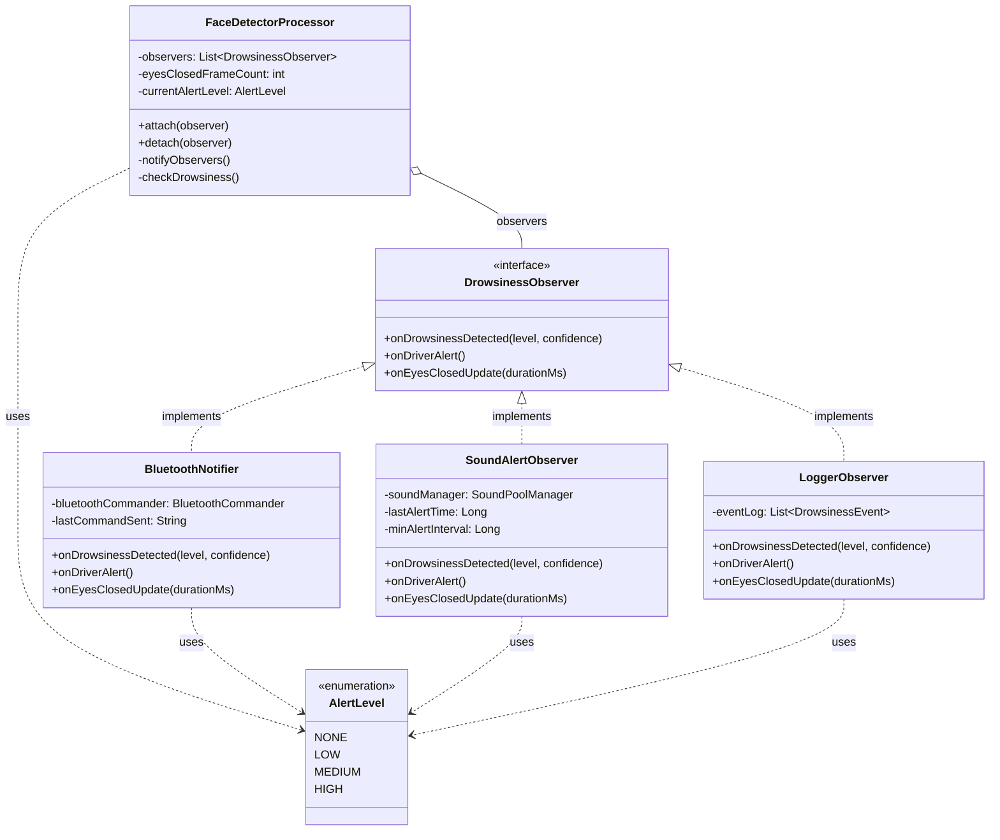
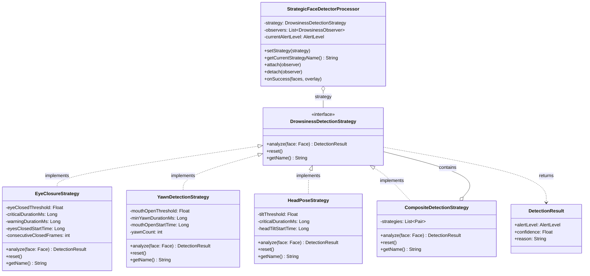
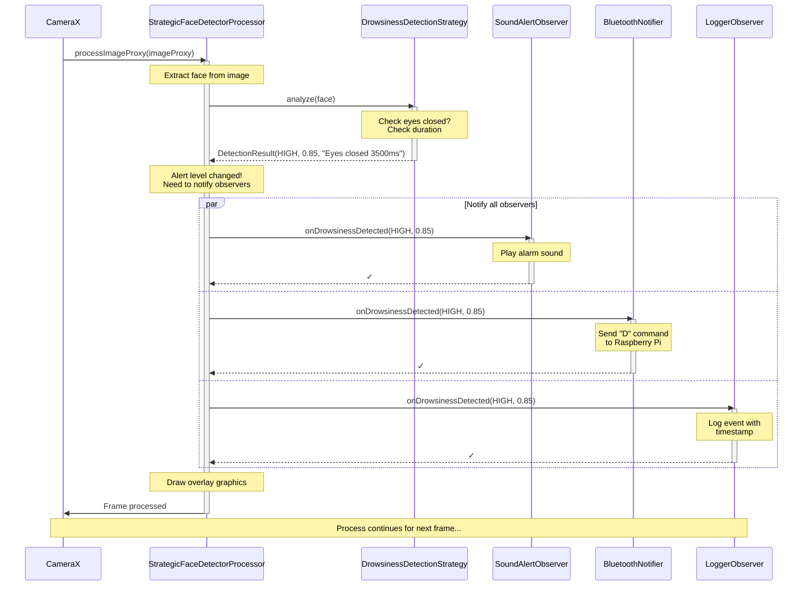

# Padrões de Projeto Aplicáveis ao Sistema de Detecção de Sonolência

---

## 1. Padrão **Observer (Observador)**

### **Justificativa**

O padrão Observer é **essencial** para este projeto pelos seguintes motivos:

#### **Por que é útilno contexto:**

1. **Comunicação Assíncrona Bluetooth**: O `BluetoothCommander` precisa notificar a MainActivity e o FaceDetectorProcessor sobre mudanças de estado da conexão (conectado, desconectado, erro) sem acoplamento direto.

2. **Eventos de Detecção de Sonolência**: Quando o `FaceDetectorProcessor` detecta sonolência, múltiplos componentes precisam ser notificados:
   - SoundPoolManager (tocar alarme)
   - BluetoothCommander (enviar comando para Raspberry Pi)
   - MainActivity (atualizar UI)
   - Possíveis futuros listeners (logging, analytics, notificações)

3. **Desacoplamento**: Permite que os detectores (subjects) não precisem conhecer os detalhes dos componentes que reagem às detecções (observers).

4. **Extensibilidade**: Facilita adicionar novos comportamentos (como salvar histórico, enviar telemetria) sem modificar o código existente.

### **Implementação Atual (Parcial)**

O projeto já utiliza callbacks que são uma forma simplificada do Observer:

```kotlin
// Em BluetoothCommander.kt
var onConnectionStateChanged: ((state: Int, message: String) -> Unit)? = null
var onMessageReceived: ((message: String) -> Unit)? = null
```
---

## 2. Padrão **Strategy (Estratégia)**

### **Justificativa**

O padrão Strategy é **altamente adequado** para este projeto pelos seguintes motivos:

#### **Por que é útil no contexto:**

1. **Múltiplos Algoritmos de Detecção**: O sistema pode ter diferentes estratégias de detecção:
   - Detecção baseada em olhos fechados (atual)
   - Detecção baseada em bocejo
   - Detecção baseada em head pose (inclinação da cabeça)
   - Combinação de múltiplos fatores

2. **Diferentes Critérios de Alerta**: Estratégias variadas para decidir quando alertar:
   - Threshold fixo (atual: 5 frames)
   - Threshold adaptativo baseado em histórico do motorista
   - Machine Learning para padrões complexos

3. **Flexibilidade em Tempo de Execução**: Permite trocar algoritmos dinamicamente baseado em:
   - Preferências do usuário
   - Condições de iluminação
   - Performance do dispositivo
   - Contexto (estrada, cidade, noite)

4. **Testabilidade**: Facilita testar diferentes algoritmos isoladamente.

### **Implementação Atual (Limitada)**

Atualmente existe uma hierarquia com `VisionProcessorBase` e `FaceDetectorProcessor`, mas o algoritmo de detecção está hardcoded dentro do processador.

---

# Diagramas UML com Padrões Aplicados

## Diagrama 1: Observer Pattern - Sistema de Notificações



### **Explicação do Diagrama Observer:**

1. **DrowsinessObserver**: Interface que define os métodos que todos os observadores devem implementar
2. **Observers Concretos**: 
   - `BluetoothNotifier`: Envia comandos para Raspberry Pi
   - `SoundAlertObserver`: Reproduz alarmes sonoros
   - `LoggerObserver`: Registra eventos para analytics
   - Facilmente extensível para: `AnalyticsObserver`, `UINotificationObserver`, `DatabaseObserver`
3. **Subject (FaceDetectorProcessor)**: Mantém lista de observers e os notifica quando detecta sonolência
4. **AlertLevel**: Enum com níveis de alerta (NONE, LOW, MEDIUM, HIGH)
5. **Fluxo**: Quando sonolência é detectada → `notifyObservers()` → todos os observers registrados são notificados simultaneamente

---

## Diagrama 2: Strategy Pattern - Algoritmos de Detecção



### **Explicação do Diagrama Strategy:**

1. **DrowsinessDetectionStrategy**: Interface que define o contrato para algoritmos de detecção
2. **Estratégias Concretas**:
   - `EyeClosureStrategy`: Detecta olhos fechados (implementação atual melhorada)
   - `YawnDetectionStrategy`: Detecta bocejo através da abertura da boca
   - `HeadPoseStrategy`: Detecta inclinação perigosa da cabeça
3. **CompositeDetectionStrategy**: Combina múltiplas estratégias com pesos diferentes
4. **StrategicFaceDetectorProcessor**: Context que usa uma estratégia e pode trocá-la em runtime
5. **DetectionResult**: Encapsula o resultado da análise (nível, confiança, razão)
6. **Flexibilidade**: Usuário pode escolher modo "Sensível", "Normal", "Tolerante" ou "Composto"

---

## Diagrama 3: Sequência - Detecção de Sonolência com Ambos os Padrões



### **Explicação do Diagrama de Sequência:**

1. **CameraX** captura frame e envia para o Processor
2. **Processor** extrai o rosto da imagem
3. **Processor** delega análise para a **Strategy** atual (Strategy Pattern)
4. **Strategy** executa algoritmo específico (ex: verifica olhos fechados e duração)
5. **Strategy** retorna `DetectionResult` com nível de alerta HIGH
6. **Processor** detecta mudança no nível de alerta
7. **Processor notifica TODOS os Observers em paralelo** (Observer Pattern):
   - **SoundObserver** reproduz alarme sonoro
   - **BluetoothObserver** envia comando "D" para Raspberry Pi
   - **LoggerObserver** registra evento com timestamp
8. **Processor** desenha overlay gráfico na tela
9. Processo continua para próximo frame

**Vantagens da combinação dos padrões:**
- ✅ Detecção (Strategy) separada de Notificação (Observer)
- ✅ Fácil adicionar novos algoritmos sem afetar notificações
- ✅ Fácil adicionar novos observadores sem afetar detecção
- ✅ Testabilidade: cada componente pode ser testado isoladamente

---

## Diagrama 4: Arquitetura Geral do Sistema

```mermaid
graph TB
    subgraph PresentationLayer["Presentation Layer"]
        MainActivity[MainActivity]
        UI[UI Components]
    end
    
    subgraph DetectionLayer["Detection Layer - Strategy Pattern"]
        Processor[StrategicFaceDetectorProcessor]
        StrategyInterface[DrowsinessDetectionStrategy]
        EyeStrategy[EyeClosureStrategy]
        YawnStrategy[YawnDetectionStrategy]
        HeadStrategy[HeadPoseStrategy]
        CompositeStrategy[CompositeDetectionStrategy]
    end
    
    subgraph NotificationLayer["Notification Layer - Observer Pattern"]
        ObserverInterface[DrowsinessObserver]
        SoundObserver[SoundAlertObserver]
        BluetoothObserver[BluetoothNotifier]
        LogObserver[LoggerObserver]
        AnalyticsObserver[AnalyticsObserver]
    end
    
    subgraph InfrastructureLayer["Infrastructure Layer"]
        Camera[CameraX]
        MLKit[ML Kit Face Detection]
        Bluetooth[BluetoothCommander]
        Sound[SoundPoolManager]
    end
    
    MainActivity -->|configures| Processor
    Camera -->|frames| Processor
    Processor -->|uses| StrategyInterface
    
    EyeStrategy -.->|implements| StrategyInterface
    YawnStrategy -.->|implements| StrategyInterface
    HeadStrategy -.->|implements| StrategyInterface
    CompositeStrategy -.->|implements| StrategyInterface
    CompositeStrategy -->|combines| EyeStrategy
    CompositeStrategy -->|combines| YawnStrategy
    
    Processor -->|notifies| ObserverInterface
    SoundObserver -.->|implements| ObserverInterface
    BluetoothObserver -.->|implements| ObserverInterface
    LogObserver -.->|implements| ObserverInterface
    AnalyticsObserver -.->|implements| ObserverInterface
    
    Processor -->|face detection| MLKit
    SoundObserver -->|plays audio| Sound
    BluetoothObserver -->|sends commands| Bluetooth
    Processor -->|updates| UI
    
    style Processor fill:#4CAF50,color:#fff
    style StrategyInterface fill:#2196F3,color:#fff
    style ObserverInterface fill:#FF9800,color:#fff
```



### **Explicação do Diagrama de Arquitetura:**

**Camadas da Arquitetura:**

1. **Presentation Layer**: MainActivity e componentes de UI
2. **Detection Layer**: Processador e estratégias de detecção (Strategy Pattern)
3. **Notification Layer**: Observers que reagem a eventos (Observer Pattern)
4. **Infrastructure Layer**: Serviços de baixo nível (Camera, ML, Bluetooth, Audio)

**Fluxo de Dados:**
- Frames da câmera → Processor → Strategy (analisa) → Observers (reagem)
- Completa separação de responsabilidades
- Baixo acoplamento, alta coesão

---

# Implementação em Código

## Exemplo 1: Observer Pattern Refatorado

### Interface Observer
```kotlin
package io.github.chayanforyou.drowsinessdetection.observers

/**
 * Observer interface for drowsiness detection events
 * Implements the Observer Pattern
 */
interface DrowsinessObserver {
    /**
     * Called when drowsiness is detected
     * @param level Severity level (LOW, MEDIUM, HIGH)
     * @param confidence Detection confidence (0.0 to 1.0)
     */
    fun onDrowsinessDetected(level: AlertLevel, confidence: Float)
    
    /**
     * Called when driver becomes alert again
     */
    fun onDriverAlert()
    
    /**
     * Called periodically with eye closure duration
     * @param durationMs Duration in milliseconds
     */
    fun onEyesClosedUpdate(durationMs: Long)
}

/**
 * Alert levels for drowsiness
 */
enum class AlertLevel {
    NONE,    // Driver is alert
    LOW,     // Slight drowsiness
    MEDIUM,  // Moderate drowsiness
    HIGH     // Critical - immediate action needed
}
```

### Observers Concretos
```kotlin
package io.github.chayanforyou.drowsinessdetection.observers

import android.util.Log
import io.github.chayanforyou.drowsinessdetection.utils.SoundPoolManager

/**
 * Observer that handles audio alerts
 */
class SoundAlertObserver(
    private val soundManager: SoundPoolManager
) : DrowsinessObserver {
    
    companion object {
        private const val TAG = "SoundAlertObserver"
    }
    
    private var lastAlertTime = 0L
    private val minAlertInterval = 3000L // 3 seconds between alerts
    
    override fun onDrowsinessDetected(level: AlertLevel, confidence: Float) {
        val currentTime = System.currentTimeMillis()
        
        when (level) {
            AlertLevel.HIGH -> {
                if (currentTime - lastAlertTime > minAlertInterval) {
                    Log.i(TAG, "HIGH drowsiness detected! Playing alarm...")
                    soundManager.playSound(volume = 1.0f)
                    lastAlertTime = currentTime
                }
            }
            AlertLevel.MEDIUM -> {
                // Play softer alert
                soundManager.playSound(volume = 0.6f)
            }
            else -> {
                // No sound for LOW level
            }
        }
    }
    
    override fun onDriverAlert() {
        Log.d(TAG, "Driver is alert - stopping sounds")
        soundManager.stop()
    }
    
    override fun onEyesClosedUpdate(durationMs: Long) {
        // Optional: Could play warning sound if duration is long
        if (durationMs > 2000) {
            Log.w(TAG, "Eyes closed for ${durationMs}ms")
        }
    }
}

/**
 * Observer that handles Bluetooth communication with Raspberry Pi
 */
class BluetoothNotifier(
    private val bluetoothCommander: BluetoothCommander
) : DrowsinessObserver {
    
    companion object {
        private const val TAG = "BluetoothNotifier"
    }
    
    private var lastCommandSent = ""
    
    override fun onDrowsinessDetected(level: AlertLevel, confidence: Float) {
        val command = when (level) {
            AlertLevel.HIGH -> "D"    // Drowsy - stop vehicle
            AlertLevel.MEDIUM -> "W"  // Warning
            AlertLevel.LOW -> "L"     // Low alert
            AlertLevel.NONE -> "N"    // Normal
        }
        
        // Only send if different from last command (avoid flooding)
        if (command != lastCommandSent) {
            Log.i(TAG, "Sending command to Pi: $command (level: $level)")
            bluetoothCommander.sendCommand(command)
            lastCommandSent = command
        }
    }
    
    override fun onDriverAlert() {
        Log.i(TAG, "Driver alert - sending Normal command")
        bluetoothCommander.sendCommand("N")
        lastCommandSent = "N"
    }
    
    override fun onEyesClosedUpdate(durationMs: Long) {
        // Could send progressive warnings based on duration
    }
}

/**
 * Observer that logs events for analytics/debugging
 */
class LoggerObserver : DrowsinessObserver {
    
    companion object {
        private const val TAG = "LoggerObserver"
    }
    
    private val eventLog = mutableListOf<DrowsinessEvent>()
    
    override fun onDrowsinessDetected(level: AlertLevel, confidence: Float) {
        val event = DrowsinessEvent(
            timestamp = System.currentTimeMillis(),
            level = level,
            confidence = confidence
        )
        eventLog.add(event)
        Log.i(TAG, "Logged event: $event")
        
        // Could save to database or send to analytics service
    }
    
    override fun onDriverAlert() {
        Log.i(TAG, "Driver became alert")
    }
    
    override fun onEyesClosedUpdate(durationMs: Long) {
        // Log duration metrics
    }
    
    data class DrowsinessEvent(
        val timestamp: Long,
        val level: AlertLevel,
        val confidence: Float
    )
}
```

### Subject (Publicador)
```kotlin
package io.github.chayanforyou.drowsinessdetection.processors

import android.content.Context
import android.util.Log
import com.google.mlkit.vision.face.Face
import com.google.mlkit.vision.face.FaceDetectorOptions
import io.github.chayanforyou.drowsinessdetection.observers.AlertLevel
import io.github.chayanforyou.drowsinessdetection.observers.DrowsinessObserver
import io.github.chayanforyou.drowsinessdetection.overlay.GraphicOverlay

/**
 * Face detector processor implementing Observer Pattern as Subject
 */
class FaceDetectorProcessorRefactored(
    context: Context,
    detectorOptions: FaceDetectorOptions?
) : VisionProcessorBase<List<Face>>(context) {

    companion object {
        private const val TAG = "FaceDetectorRefactored"
        private const val EYES_CLOSED_THRESHOLD = 0.50f
    }

    // List of observers (Observer Pattern)
    private val observers = mutableListOf<DrowsinessObserver>()
    
    private var eyesClosedFrameCount = 0
    private var eyesClosedStartTime = 0L
    private var currentAlertLevel = AlertLevel.NONE

    /**
     * Attach an observer
     */
    fun attach(observer: DrowsinessObserver) {
        if (!observers.contains(observer)) {
            observers.add(observer)
            Log.d(TAG, "Observer attached: ${observer.javaClass.simpleName}")
        }
    }

    /**
     * Detach an observer
     */
    fun detach(observer: DrowsinessObserver) {
        if (observers.remove(observer)) {
            Log.d(TAG, "Observer detached: ${observer.javaClass.simpleName}")
        }
    }

    /**
     * Notify all observers of drowsiness detection
     */
    private fun notifyDrowsinessDetected(level: AlertLevel, confidence: Float) {
        Log.d(TAG, "Notifying ${observers.size} observers - Level: $level")
        observers.forEach { observer ->
            try {
                observer.onDrowsinessDetected(level, confidence)
            } catch (e: Exception) {
                Log.e(TAG, "Error notifying observer: ${e.message}")
            }
        }
    }

    /**
     * Notify all observers that driver is alert
     */
    private fun notifyDriverAlert() {
        observers.forEach { observer ->
            try {
                observer.onDriverAlert()
            } catch (e: Exception) {
                Log.e(TAG, "Error notifying observer: ${e.message}")
            }
        }
    }

    /**
     * Notify observers of eyes closed duration
     */
    private fun notifyEyesClosedUpdate(durationMs: Long) {
        observers.forEach { observer ->
            try {
                observer.onEyesClosedUpdate(durationMs)
            } catch (e: Exception) {
                Log.e(TAG, "Error notifying observer: ${e.message}")
            }
        }
    }

    override fun onSuccess(faces: List<Face>, graphicOverlay: GraphicOverlay) {
        if (faces.isEmpty()) {
            handleNoFaceDetected()
            return
        }

        var isAnyFaceDrowsy = false

        for (face in faces) {
            val leftEyeOpen = face.leftEyeOpenProbability
            val rightEyeOpen = face.rightEyeOpenProbability

            if (leftEyeOpen != null && rightEyeOpen != null) {
                val avgEyeOpenness = (leftEyeOpen + rightEyeOpen) / 2.0f

                if (avgEyeOpenness < EYES_CLOSED_THRESHOLD) {
                    isAnyFaceDrowsy = true
                    handleEyesClosed(avgEyeOpenness)
                }
            }
        }

        if (!isAnyFaceDrowsy) {
            handleEyesOpen()
        }
    }

    private fun handleEyesClosed(eyeOpenness: Float) {
        if (eyesClosedFrameCount == 0) {
            eyesClosedStartTime = System.currentTimeMillis()
        }
        
        eyesClosedFrameCount++
        val durationMs = System.currentTimeMillis() - eyesClosedStartTime

        // Notify duration update
        notifyEyesClosedUpdate(durationMs)

        // Determine alert level based on duration
        val newLevel = when {
            durationMs > 3000 -> AlertLevel.HIGH     // 3+ seconds
            durationMs > 1500 -> AlertLevel.MEDIUM   // 1.5-3 seconds
            durationMs > 500 -> AlertLevel.LOW       // 0.5-1.5 seconds
            else -> AlertLevel.NONE
        }

        // Only notify if level changed
        if (newLevel != currentAlertLevel && newLevel != AlertLevel.NONE) {
            val confidence = 1.0f - eyeOpenness // Lower openness = higher confidence of drowsiness
            notifyDrowsinessDetected(newLevel, confidence)
            currentAlertLevel = newLevel
        }
    }

    private fun handleEyesOpen() {
        if (currentAlertLevel != AlertLevel.NONE) {
            notifyDriverAlert()
            currentAlertLevel = AlertLevel.NONE
        }
        eyesClosedFrameCount = 0
        eyesClosedStartTime = 0L
    }

    private fun handleNoFaceDetected() {
        // Could be considered as a different type of alert
        if (currentAlertLevel != AlertLevel.NONE) {
            notifyDriverAlert()
            currentAlertLevel = AlertLevel.NONE
        }
        eyesClosedFrameCount = 0
    }

    override fun onFailure(e: Exception) {
        Log.e(TAG, "Face detection failed: $e")
        handleNoFaceDetected()
    }

    // ...existing methods from VisionProcessorBase...
}
```

---

## Exemplo 2: Strategy Pattern para Algoritmos de Detecção

### Interface Strategy
```kotlin
package io.github.chayanforyou.drowsinessdetection.strategies

import com.google.mlkit.vision.face.Face
import io.github.chayanforyou.drowsinessdetection.observers.AlertLevel

/**
 * Strategy interface for drowsiness detection algorithms
 * Implements the Strategy Pattern
 */
interface DrowsinessDetectionStrategy {
    /**
     * Analyze a detected face for drowsiness signs
     * @param face Face detected by ML Kit
     * @return Alert level based on analysis
     */
    fun analyze(face: Face): DetectionResult
    
    /**
     * Reset internal state (counters, timers, etc.)
     */
    fun reset()
    
    /**
     * Get human-readable name of this strategy
     */
    fun getName(): String
}

/**
 * Result of drowsiness detection analysis
 */
data class DetectionResult(
    val alertLevel: AlertLevel,
    val confidence: Float,
    val reason: String
)
```

### Estratégias Concretas
```kotlin
package io.github.chayanforyou.drowsinessdetection.strategies

import android.util.Log
import com.google.mlkit.vision.face.Face

/**
 * Strategy that detects drowsiness based on eye closure
 */
class EyeClosureStrategy(
    private val eyeClosedThreshold: Float = 0.50f,
    private val criticalDurationMs: Long = 3000,
    private val warningDurationMs: Long = 1500
) : DrowsinessDetectionStrategy {

    companion object {
        private const val TAG = "EyeClosureStrategy"
    }

    private var eyesClosedStartTime = 0L
    private var consecutiveClosedFrames = 0

    override fun analyze(face: Face): DetectionResult {
        val leftEyeOpen = face.leftEyeOpenProbability ?: return noDetection()
        val rightEyeOpen = face.rightEyeOpenProbability ?: return noDetection()

        val avgOpenness = (leftEyeOpen + rightEyeOpen) / 2.0f
        val areEyesClosed = avgOpenness < eyeClosedThreshold

        if (areEyesClosed) {
            if (eyesClosedStartTime == 0L) {
                eyesClosedStartTime = System.currentTimeMillis()
            }
            consecutiveClosedFrames++

            val durationMs = System.currentTimeMillis() - eyesClosedStartTime
            val confidence = 1.0f - avgOpenness

            return when {
                durationMs >= criticalDurationMs -> {
                    Log.w(TAG, "CRITICAL: Eyes closed for ${durationMs}ms")
                    DetectionResult(
                        alertLevel = AlertLevel.HIGH,
                        confidence = confidence,
                        reason = "Eyes closed for ${durationMs}ms"
                    )
                }
                durationMs >= warningDurationMs -> {
                    DetectionResult(
                        alertLevel = AlertLevel.MEDIUM,
                        confidence = confidence,
                        reason = "Eyes closed for ${durationMs}ms"
                    )
                }
                else -> {
                    DetectionResult(
                        alertLevel = AlertLevel.LOW,
                        confidence = confidence,
                        reason = "Eyes closing (${consecutiveClosedFrames} frames)"
                    )
                }
            }
        } else {
            reset()
            return noDetection()
        }
    }

    override fun reset() {
        eyesClosedStartTime = 0L
        consecutiveClosedFrames = 0
    }

    override fun getName() = "Eye Closure Detection"

    private fun noDetection() = DetectionResult(
        alertLevel = AlertLevel.NONE,
        confidence = 0.0f,
        reason = "Eyes open"
    )
}

/**
 * Strategy that detects drowsiness based on yawning
 */
class YawnDetectionStrategy(
    private val mouthOpenThreshold: Float = 0.70f,
    private val minYawnDurationMs: Long = 1000
) : DrowsinessDetectionStrategy {

    companion object {
        private const val TAG = "YawnDetectionStrategy"
    }

    private var mouthOpenStartTime = 0L
    private var yawnCount = 0
    private val yawnWindowMs = 60000L // 1 minute

    override fun analyze(face: Face): DetectionResult {
        // ML Kit doesn't provide mouth openness directly
        // We can estimate using face landmarks or contours
        
        // For this example, let's use smilingProbability as inverse indicator
        val smilingProb = face.smilingProbability ?: return noDetection()
        
        // Low smiling + specific mouth landmarks could indicate yawn
        // This is simplified - real implementation would use mouth landmarks
        val isMouthOpen = smilingProb < 0.3f

        if (isMouthOpen) {
            if (mouthOpenStartTime == 0L) {
                mouthOpenStartTime = System.currentTimeMillis()
            }

            val durationMs = System.currentTimeMillis() - mouthOpenStartTime

            if (durationMs >= minYawnDurationMs) {
                yawnCount++
                Log.i(TAG, "Yawn detected! Total yawns: $yawnCount")
                
                reset() // Reset for next yawn

                val confidence = when {
                    yawnCount >= 3 -> 0.9f
                    yawnCount == 2 -> 0.7f
                    else -> 0.5f
                }

                val level = when {
                    yawnCount >= 3 -> AlertLevel.HIGH
                    yawnCount == 2 -> AlertLevel.MEDIUM
                    else -> AlertLevel.LOW
                }

                return DetectionResult(
                    alertLevel = level,
                    confidence = confidence,
                    reason = "Yawn detected ($yawnCount yawns in last minute)"
                )
            }
        } else {
            mouthOpenStartTime = 0L
        }

        return noDetection()
    }

    override fun reset() {
        mouthOpenStartTime = 0L
    }

    override fun getName() = "Yawn Detection"

    private fun noDetection() = DetectionResult(
        alertLevel = AlertLevel.NONE,
        confidence = 0.0f,
        reason = "No yawn detected"
    )
}

/**
 * Strategy that detects drowsiness based on head pose
 */
class HeadPoseStrategy(
    private val tiltThreshold: Float = 15.0f,
    private val criticalDurationMs: Long = 2000
) : DrowsinessDetectionStrategy {

    companion object {
        private const val TAG = "HeadPoseStrategy"
    }

    private var headTiltStartTime = 0L

    override fun analyze(face: Face): DetectionResult {
        // Get Euler angles (rotation)
        val eulerY = face.headEulerAngleY // Horizontal rotation
        val eulerZ = face.headEulerAngleZ // Tilt rotation

        // Check if head is tilted dangerously
        val isTilted = kotlin.math.abs(eulerZ) > tiltThreshold

        if (isTilted) {
            if (headTiltStartTime == 0L) {
                headTiltStartTime = System.currentTimeMillis()
            }

            val durationMs = System.currentTimeMillis() - headTiltStartTime
            val confidence = (kotlin.math.abs(eulerZ) / 90.0f).coerceIn(0.0f, 1.0f)

            return when {
                durationMs >= criticalDurationMs -> {
                    Log.w(TAG, "CRITICAL: Head tilted ${eulerZ}° for ${durationMs}ms")
                    DetectionResult(
                        alertLevel = AlertLevel.HIGH,
                        confidence = confidence,
                        reason = "Head tilted ${eulerZ.toInt()}° for ${durationMs}ms"
                    )
                }
                durationMs >= 1000 -> {
                    DetectionResult(
                        alertLevel = AlertLevel.MEDIUM,
                        confidence = confidence,
                        reason = "Head tilted ${eulerZ.toInt()}°"
                    )
                }
                else -> {
                    DetectionResult(
                        alertLevel = AlertLevel.LOW,
                        confidence = confidence,
                        reason = "Head tilting"
                    )
                }
            }
        } else {
            reset()
            return noDetection()
        }
    }

    override fun reset() {
        headTiltStartTime = 0L
    }

    override fun getName() = "Head Pose Detection"

    private fun noDetection() = DetectionResult(
        alertLevel = AlertLevel.NONE,
        confidence = 0.0f,
        reason = "Head position normal"
    )
}

/**
 * Composite Strategy that combines multiple strategies
 * Uses weighted average of results
 */
class CompositeDetectionStrategy(
    private val strategies: List<Pair<DrowsinessDetectionStrategy, Float>>
) : DrowsinessDetectionStrategy {

    companion object {
        private const val TAG = "CompositeStrategy"
    }

    init {
        require(strategies.isNotEmpty()) { "Must provide at least one strategy" }
        
        val totalWeight = strategies.sumOf { it.second.toDouble() }
        require(kotlin.math.abs(totalWeight - 1.0) < 0.01) { 
            "Weights must sum to 1.0, got $totalWeight" 
        }
    }

    override fun analyze(face: Face): DetectionResult {
        val results = strategies.map { (strategy, weight) ->
            val result = strategy.analyze(face)
            Triple(result, weight, strategy.getName())
        }

        // Calculate weighted average
        var weightedScore = 0.0f
        var weightedConfidence = 0.0f
        val reasons = mutableListOf<String>()

        results.forEach { (result, weight, name) ->
            val levelScore = when (result.alertLevel) {
                AlertLevel.HIGH -> 3.0f
                AlertLevel.MEDIUM -> 2.0f
                AlertLevel.LOW -> 1.0f
                AlertLevel.NONE -> 0.0f
            }
            
            weightedScore += levelScore * weight
            weightedConfidence += result.confidence * weight

            if (result.alertLevel != AlertLevel.NONE) {
                reasons.add("$name: ${result.reason}")
            }
        }

        val finalLevel = when {
            weightedScore >= 2.5f -> AlertLevel.HIGH
            weightedScore >= 1.5f -> AlertLevel.MEDIUM
            weightedScore >= 0.5f -> AlertLevel.LOW
            else -> AlertLevel.NONE
        }

        Log.d(TAG, "Composite result: score=$weightedScore, level=$finalLevel")

        return DetectionResult(
            alertLevel = finalLevel,
            confidence = weightedConfidence,
            reason = if (reasons.isEmpty()) "All indicators normal" else reasons.joinToString("; ")
        )
    }

    override fun reset() {
        strategies.forEach { it.first.reset() }
    }

    override fun getName() = "Composite Detection (${strategies.size} strategies)"
}
```

### Processor usando Strategy
```kotlin
package io.github.chayanforyou.drowsinessdetection.processors

import android.content.Context
import android.util.Log
import com.google.mlkit.vision.face.Face
import com.google.mlkit.vision.face.FaceDetectorOptions
import io.github.chayanforyou.drowsinessdetection.observers.AlertLevel
import io.github.chayanforyou.drowsinessdetection.observers.DrowsinessObserver
import io.github.chayanforyou.drowsinessdetection.overlay.GraphicOverlay
import io.github.chayanforyou.drowsinessdetection.strategies.DrowsinessDetectionStrategy
import io.github.chayanforyou.drowsinessdetection.strategies.EyeClosureStrategy

/**
 * Face detector processor using Strategy Pattern
 * Can switch detection algorithms at runtime
 */
class StrategicFaceDetectorProcessor(
    context: Context,
    detectorOptions: FaceDetectorOptions?,
    initialStrategy: DrowsinessDetectionStrategy = EyeClosureStrategy()
) : VisionProcessorBase<List<Face>>(context) {

    companion object {
        private const val TAG = "StrategicFaceDetector"
    }

    // Current detection strategy (Strategy Pattern)
    private var strategy: DrowsinessDetectionStrategy = initialStrategy

    // Observers list (Observer Pattern)
    private val observers = mutableListOf<DrowsinessObserver>()

    private var currentAlertLevel = AlertLevel.NONE

    /**
     * Change detection strategy at runtime
     */
    fun setStrategy(newStrategy: DrowsinessDetectionStrategy) {
        Log.i(TAG, "Switching strategy from ${strategy.getName()} to ${newStrategy.getName()}")
        strategy.reset()
        strategy = newStrategy
        currentAlertLevel = AlertLevel.NONE
    }

    /**
     * Get current strategy name
     */
    fun getCurrentStrategyName() = strategy.getName()

    /**
     * Attach observer
     */
    fun attach(observer: DrowsinessObserver) {
        if (!observers.contains(observer)) {
            observers.add(observer)
        }
    }

    /**
     * Detach observer
     */
    fun detach(observer: DrowsinessObserver) {
        observers.remove(observer)
    }

    override fun onSuccess(faces: List<Face>, graphicOverlay: GraphicOverlay) {
        if (faces.isEmpty()) {
            handleNoFace()
            return
        }

        // Analyze first face (or could analyze all and combine results)
        val face = faces.first()
        
        // Use strategy to analyze (Strategy Pattern)
        val result = strategy.analyze(face)

        Log.d(TAG, "Detection result: ${result.alertLevel} - ${result.reason} (confidence: ${result.confidence})")

        // Notify observers if level changed (Observer Pattern)
        if (result.alertLevel != currentAlertLevel) {
            if (result.alertLevel != AlertLevel.NONE) {
                notifyDrowsinessDetected(result.alertLevel, result.confidence)
            } else {
                notifyDriverAlert()
            }
            currentAlertLevel = result.alertLevel
        }

        // Draw graphics
        drawFaceGraphics(faces, graphicOverlay, result)
    }

    private fun handleNoFace() {
        if (currentAlertLevel != AlertLevel.NONE) {
            notifyDriverAlert()
            currentAlertLevel = AlertLevel.NONE
        }
        strategy.reset()
    }

    private fun notifyDrowsinessDetected(level: AlertLevel, confidence: Float) {
        observers.forEach { it.onDrowsinessDetected(level, confidence) }
    }

    private fun notifyDriverAlert() {
        observers.forEach { it.onDriverAlert() }
    }

    private fun drawFaceGraphics(
        faces: List<Face>,
        graphicOverlay: GraphicOverlay,
        result: DetectionResult
    ) {
        // Draw face graphics with color based on alert level
        // Implementation details...
    }

    override fun onFailure(e: Exception) {
        Log.e(TAG, "Detection failed: $e")
        handleNoFace()
    }

    // ...existing methods from VisionProcessorBase...
}
```

### Uso em MainActivity
```kotlin
class MainActivity : AppCompatActivity() {

    private lateinit var processor: StrategicFaceDetectorProcessor
    private lateinit var soundObserver: SoundAlertObserver
    private lateinit var bluetoothObserver: BluetoothNotifier
    private lateinit var loggerObserver: LoggerObserver

    private fun setupProcessor() {
        // Create detection strategy
        val strategy = when (getUserPreference()) {
            "sensitive" -> EyeClosureStrategy(
                eyeClosedThreshold = 0.60f,
                criticalDurationMs = 2000
            )
            "normal" -> EyeClosureStrategy() // Default values
            "tolerant" -> EyeClosureStrategy(
                eyeClosedThreshold = 0.40f,
                criticalDurationMs = 4000
            )
            "composite" -> CompositeDetectionStrategy(
                listOf(
                    EyeClosureStrategy() to 0.5f,
                    YawnDetectionStrategy() to 0.3f,
                    HeadPoseStrategy() to 0.2f
                )
            )
            else -> EyeClosureStrategy()
        }

        // Create processor with strategy
        val options = FaceDetectorOptions.Builder()
            .setClassificationMode(FaceDetectorOptions.CLASSIFICATION_MODE_ALL)
            .setLandmarkMode(FaceDetectorOptions.LANDMARK_MODE_ALL)
            .build()

        processor = StrategicFaceDetectorProcessor(
            context = applicationContext,
            detectorOptions = options,
            initialStrategy = strategy
        )

        // Create and attach observers
        soundObserver = SoundAlertObserver(SoundPoolManager.getInstance(this))
        bluetoothObserver = BluetoothNotifier(bluetoothCommander)
        loggerObserver = LoggerObserver()

        processor.attach(soundObserver)
        processor.attach(bluetoothObserver)
        processor.attach(loggerObserver)

        Log.i("MainActivity", "Using strategy: ${processor.getCurrentStrategyName()}")
    }

    fun switchToYawnDetection() {
        // User can switch detection mode at runtime
        processor.setStrategy(YawnDetectionStrategy())
        Toast.makeText(this, "Switched to Yawn Detection", Toast.LENGTH_SHORT).show()
    }

    fun switchToCompositeMode() {
        val composite = CompositeDetectionStrategy(
            listOf(
                EyeClosureStrategy() to 0.6f,
                YawnDetectionStrategy() to 0.4f
            )
        )
        processor.setStrategy(composite)
        Toast.makeText(this, "Switched to Composite Detection", Toast.LENGTH_SHORT).show()
    }
}
```

---

## Benefícios da Refatoração com os Padrões

### Observer Pattern:
✅ **Desacoplamento**: Processor não precisa conhecer SoundManager ou BluetoothCommander
✅ **Extensibilidade**: Adicionar novos observadores (UI, Database, Analytics) sem modificar Processor
✅ **Testabilidade**: Fácil mockar observers em testes unitários
✅ **Manutenibilidade**: Cada observer tem responsabilidade única

### Strategy Pattern:
✅ **Flexibilidade**: Trocar algoritmos de detecção em runtime
✅ **Testabilidade**: Testar cada estratégia isoladamente
✅ **Configurabilidade**: Usuário pode escolher modo (Sensível/Normal/Tolerante)
✅ **Reutilização**: Estratégias podem ser compostas (CompositeStrategy)

### Combinação dos Dois:
🎯 **Separation of Concerns**: Detecção (Strategy) separada de Notificação (Observer)
🎯 **Open/Closed Principle**: Aberto para extensão, fechado para modificação
🎯 **Single Responsibility**: Cada classe tem uma responsabilidade clara

---

## Conclusão

Os padrões **Observer** e **Strategy** são ideais para este projeto porque:

1. **Observer** resolve o problema de notificar múltiplos componentes (som, Bluetooth, UI, logs) quando sonolência é detectada

2. **Strategy** permite trocar algoritmos de detecção (olhos, bocejo, postura) dinamicamente e combiná-los

3. Ambos melhoram **testabilidade**, **manutenibilidade** e **extensibilidade** do código

4. São padrões amplamente conhecidos, facilitando onboarding de novos desenvolvedores

5. Preparam o código para futuras features (ML models, múltiplos sensores, personalização)
